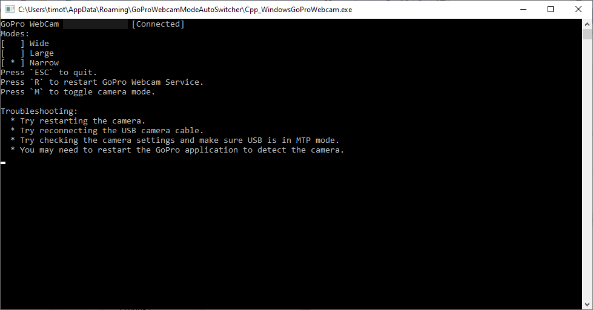

# Overview

GoProWebcamModeAutoSwitcher is a C++ Console App that detects when the GoPro 8 is used as a webcam.

When the camera is connected, the app can auto switch between WIDE, LARGE, and NARROW so the user doesn't have to do that manually.

## Related

* [How To Use Your GoPro As A Webcam](https://community.gopro.com/s/article/GoPro-Webcam?language=en_US)

## Screenshot

## Videos ##

**Intro Video**

## Release

* You can find a Windows 32-bit installer in the [Release](https://github.com/tgraupmann/Cpp_WindowsGoProWebcam/releases/tag/1.0) section.

## Support

Contact `Tim Graupmann#0611` on Discord for support.
